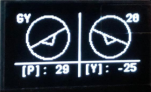

# stm32-continuous-data-transmission (C mbed)

### Context
This project was done during my BSc 3rd for a small project. This project consisted of a free design in which was required to program a STM32 device.

### Purpose of the project
The purpose is to create a system which sends the information acquired by a sensor intermittently to an external device wirelessly.
The system also shows the acquired info in an integrated screen.

### Project architecture

As C language does not support OOP, the structure followed for this implementation is based on files.

#### Visual_Interface
This block is used to manage the UI visualizations and show them in the integrated screen(SSD1306).

#### EXTI Manager
This block is used to manage the external interruptions used to force the states transitions.

#### HC-05
This block is used to transmit the data to an external device via bluetooth.

#### SSD1306
This block is used to facilitate the UI management by using predefined functions.

#### MPU6050
This block is used to mesure and send the data acquired by the integrated Gyroscope

